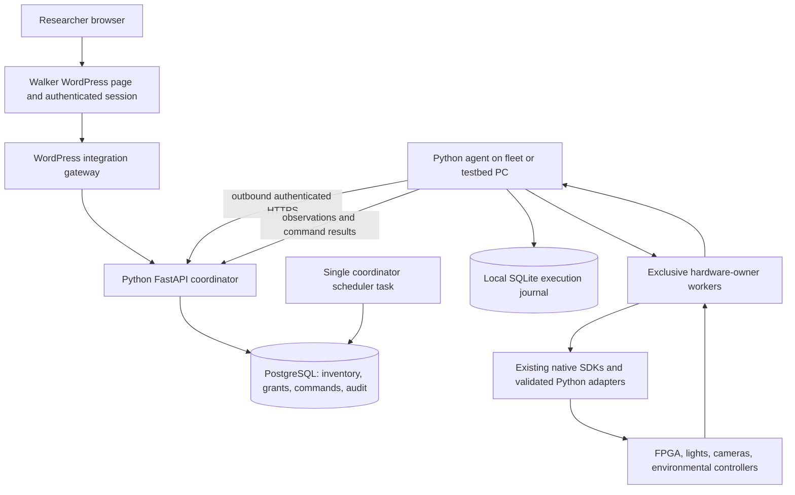

# DepiBeans architecture review packet

Prepared September 11, 2026 for the Walker Lab, Michigan State University.
Review target: an independent technical reviewer.

Updated after the first design review; see REVIEW-RESPONSE.md for decisions.

## 1. What we are building

Replace the legacy DEPI chamber-control application with a Python application
named DepiBeans. Include lighting calibration, environmental control where the
hardware supports it, experiment execution, camera acquisition, health reporting,
remote controls and scheduling. Researchers access it through accounts on the
existing Walker Lab WordPress website. Eventually cover 24 real DEPI chambers.

Immediate sequence: preserve and investigate the connected testbed; implement
and validate Python functionality there; then connect the PC already managing
remote access to the chambers and use its working installation as the fleet
reference. Do not interrupt the current controller, experiments, calibration,
firmware, addressing, network settings or native drivers during inspection.

Target milestone: **Friday September 18, 2026, 4 p.m. America/Detroit** — a useful
website portal showing the 24 real chambers and their honest health state.
Full Python feature parity and every physical control are broader acceptance
requirements, not verified accomplishments or an unconditional deadline promise.

## 2. Facts versus proposals

### Verified on the testbed

- Windows 10 Enterprise x64; existing Thonny Python 3.10.11 x64.
- Running Java 8 application is Lighting Calibratron.jar, PID 7284 at inspection.
- Digilent Onboard USB hardware appears in Windows, VID 1443 / PID 0005.
- Calibratron communicates with ChrisBlaster FPGA/native drivers to operate
  microcontroller lighting rails; this is not a generic networked smart bulb.
- Source present: Calibratron, older MK9000 chamber controller, modular William
  variants, ControlEngine, PhenoScript, camera interfaces, sensor resources,
  ChrisBlaster C++/Digilent headers, Vimba controller and lighting firmware.
- Some archived source is incomplete: the inspected modular Bigfoot environment
  controller throws an unsupported-operation exception in its constructor.
- Some legacy constructors initialize bitmasks and set lighting to zero. Merely
  launching a second controller could alter the current hardware state.
- Source/runtime backup completed: 24,841 archived files verified individually;
  see backups/BACKUP-RECEIPT.json for the checksum receipt.

### Implemented in the Python development foundation

- `depibeans/lighting.py`: offline wire packets and FPGA I2C waveforms.
- `depibeans/calibration.py`: legacy JSON round-trip, offline quadratic fit.
- `depibeans/core.py`: SQLite simulator engine, per-chamber permissions, command
  IDs, revision checking, expiry, durable results, audit, one-time schedule
  creation/pause/resume/delete and missed-event handling.
- `depibeans/native.py`: read-only DLL version probe; no hardware initialization.
- `depibeans/__main__.py`: temporary 1–24 chamber simulator and version probe CLI.
- Thirty-one focused automated tests passed after both independent reviews.
  The same 31 tests passed on Windows; the read-only native version probe
  returned 1.2.4. Actual physical operations remain untested.

**This is not a deployed portal, production scheduler, or working physical
replacement.** No real hardware adapter is enabled. No 24-chamber connections
are claimed. Recurring scheduling, web authentication and physical execution
remain implementation work. The existing Java application still owns hardware.

### Not yet known

- The fleet PC's OS, topology, active software version, login/service model,
  per-chamber IDs, working configurations, credentials and chamber capabilities.
- Whether one process, multiple processes or multiple computers own the 24 units.
- Which camera/SDK, environmental controller and FPGA variants are active.
- Whether WordPress hosting can proxy the API; DNS/subdomain and backend hosting
  privileges; whether institutional OIDC is available to this project.
- Required scientific protocol compatibility and validated operating limits.
- Permissions for publishing inherited MSU/vendor source. Private backup is not
  authorization to relicense or publish that source.

## 3. Recommended target stack — proposed, not installed

| Layer | Proposed choice | Reason / boundary |
|---|---|---|
| Application language | Python | Explicit requirement; application logic, coordination, adapters, scheduling and calibration in Python |
| Production Python | Pin after native/OS compatibility proof | Existing Python 3.10 for the testbed spike; do not upgrade its working environment during discovery |
| Python package workflow | pyproject.toml, uv lock, Ruff, pytest | Reproducible dependencies and checks; foundation currently uses stdlib/unittest only |
| Cloud API | FastAPI + Pydantic v2 + Uvicorn | Typed API boundary and validation; no device handles inside API workers |
| Central database | Managed PostgreSQL + SQLAlchemy 2 + Alembic | Membership, inventory, commands, schedules, audit and migrations |
| Coordinator execution | Background scheduler in one coordinator process for release 1 | One Uvicorn worker, database leadership/occurrence uniqueness; split scheduler only when needed |
| Local controller | Python supervised service/process | One hardware owner per physical resource; driver failures isolated where needed |
| Local durable storage | SQLite | Received command journal, execution attempts, telemetry spool and plan versions |
| Agent connection | Outbound authenticated HTTPS | No public inbound Windows/FPGA ports; bounded polling and backoff |
| Website | Existing WordPress page + small integration plugin | Existing website identity and navigation; chamber control remains Python |
| Frontend | Small HTML interface with minimal browser JavaScript | Avoid a second application framework; Python remains the application/control language |
| Live display | Bounded polling initially | Simple, measurable freshness; SSE optional after authentication/hosting is settled |
| Driver integration | Python ctypes/native SDK bindings | Preserve hardware timing and compatible vendor libraries; not a Java-based final controller |
| Deployment | Managed Linux service for API; native Windows process for legacy drivers | Avoid forcing USB/camera drivers into unsupported Windows containers |
| Logs/metrics | Structured logs, correlation IDs, bounded retention | Trace browser request through execution and observation; redact credentials |
| Image/data artifacts | Existing local storage first, optional object storage later | Do not move large acquisition datasets into PostgreSQL or stall control while uploading |

These are selections to review, not a claim that every latest package version has
been installed or validated. Pin exact versions after the Windows/SDK matrix is
known. Do not introduce Kubernetes, Kafka, or a workflow cluster solely for 24
chambers. Add a separate broker only if measured requirements justify it.

Python documentation provides Windows installation guidance;
OS suitability alone does not validate a vendor DLL or camera SDK. [Python docs](https://docs.python.org/3.13/using/windows.html)

FastAPI API workers are separate processes. Keep hardware ownership and scheduler
leadership out of worker startup to avoid duplicate device execution when scaling
HTTP workers. [FastAPI deployment concepts](https://fastapi.tiangolo.com/deployment/concepts/)

## 4. Logical architecture and trust boundaries

The diagram is logical, not an assertion that each chamber has a separate PC.
The fleet inventory determines where agents and hardware-owner workers run.

### Website authentication proposal

For the Friday milestone, prefer a WordPress page with a same-origin plugin
endpoint. WordPress checks its authenticated session, REST nonce and a dedicated
lab-access capability; the plugin forwards only allowed operations to Python.
Use a maintained service-auth mechanism and a short-lived, verifiable end-user
identity assertion. The Python service checks audience/issuer/expiry, binds the
stable WordPress subject to its own chamber memberships, and does not trust a
browser-supplied email, actor, role or chamber grant.

The exact assertion mechanism remains a review decision: a vetted OIDC integration
if available, or a tightly scoped gateway using maintained signing libraries,
rotated keys and replay controls. Do not invent a new cryptographic protocol.
No browser API keys, embedded administrator password, or public unauthenticated
proxy. WordPress does not need direct access to USB hardware.

WordPress cookie authentication applies inside the logged-in WordPress context
and uses REST nonces; application passwords are for API authentication, not a
browser SSO mechanism. [WordPress REST authentication](https://developer.wordpress.org/rest-api/using-the-rest-api/authentication/), [Application passwords](https://developer.wordpress.org/advanced-administration/security/application-passwords/)

### Roles

- Viewer: permitted chambers and experiment/status history.
- Researcher/operator: approved setpoints and schedules on assigned chambers.
- Commissioning administrator: device profiles, mappings, calibration uploads,
  operating envelopes and capability enablement.
- Site administrator is not implicitly authorized to actuate all lab equipment.
  Explicit chamber membership remains the Python authorization source.

The local prototype's `Engine.grant()` is a provisioning helper, not a public API.
Production endpoints must establish identity before calling the engine.

## 5. Data and state model

Stable entities: users, chamber memberships, chambers, physical resources,
agents, capability profiles, observations, commands, execution attempts,
schedules, schedule occurrences, experiment plans, calibration revisions,
artifacts and audit events.

Each chamber has a stable ID independent of a DHCP address. Its profile identifies
physical resource ownership, permitted capabilities/units/ranges, device addresses,
firmware/driver versions, calibration references and safe operational policies.
Profiles are versioned. No global default that assumes all chambers are identical.

For each displayed value retain:

1. Requested setpoint and actor/time.
2. Controller-applied/reported value and sequence/revision.
3. Independently measured value, if a sensor exists, with units and sensor identity.
4. Device observation time and server receipt time.
5. Freshness/quality and the source of each value.

Do not substitute zero for missing/stale data or label an old cached value healthy.
Distinguish host online, controller running, hardware communication, valid sensor
reading and active experiment. Use explicit unknown/unavailable states.

## 6. Command execution and ownership

Browser/API validation → membership and capability checks → compare expected
revision → persist command with ID and short expiry → assign to physical owner →
local durable receipt → record attempt before dispatch → perform operation →
read back where possible → persist result → report upstream.

A transport retry reuses the same command ID. Reusing an ID for a different request
is rejected. Database locks and a local device-owner process prevent concurrent
writers. A fleet lease alone is not sufficient fencing if old and new owners can
both access hardware: OS/device ownership and the takeover procedure must enforce
exclusivity. No automatic Java-to-Python takeover while Java is still connected.

Do not promise exactly-once physical execution for legacy devices that have no
idempotency token. If a crash occurs after the hardware acts but before the result
is committed, mark the outcome uncertain and reconcile/read back or require
operator intervention. Do not blindly replay calibration writes, pulses or image
acquisition just because a cloud acknowledgment was lost.

The current simulator can commit a state change in SQLite atomically. That is
not the production physical-I/O algorithm and must be replaced with an explicit
durable outbox/attempt journal before hardware execution is enabled.

Database work claiming may use row locks and `SKIP LOCKED` for queue consumers;
that pattern does not establish physical-device ownership. [PostgreSQL SELECT](https://www.postgresql.org/docs/17/sql-select.html)

## 7. Scheduling semantics

- Store the desired absolute settings. “Set intensity to 134” does not toggle.
- Define a schedule's local timezone explicitly; display lab timezone in the UI.
- Compile recurrence into uniquely identified, bounded occurrences with UTC times.
- Proposed DST policy: skip nonexistent spring times; execute repeated fall times
  once using an explicitly selected fold. Show this in schedule review.
- Pause/resume/delete are explicit actions. Pausing prevents future dispatch; it
  does not undo a partially applied event or switch outputs off.
- A manual portal command pauses that chamber's schedules by default. Local
  controls need observation/ownership coordination; do not claim automatic pause
  without detecting the change.
- Re-check permission, capability profile, availability, plan version, and expiry
  at dispatch. Define what happens when an account loses access after creation.
- For the first release, require connectivity for new scheduled dispatches; retain
  current hardware state according to a commissioned per-capability policy.
- Local execution of downloaded schedules during internet outages is a later,
  explicit capability with bounded validity, offline permission policy and local
  cancellation. Never silently imply an offline cloud pause has reached a device.
- Record missed/failed/partial/uncertain outcomes. Do not replay stale events on
  reconnect. Combined chamber changes are not physically atomic.
- Put device-specific operation timeouts in profiles. Do not reuse the gas mixer's
  two-minute rule for long camera acquisitions without checking the workflow.

The foundation implements one-time simulator events only. Production recurrence,
wall-clock/monotonic-clock handling and physical recovery remain pending.

## 8. Calibration, imaging and scientific validity

Keep raw DAC settings separate from calibrated physical light intensity. Preserve
legacy calibration JSON and the exact coefficient order/float representation.
Validate bounds, monotonicity where required, fitting residuals and extrapolation
policy. Version original measurements, fitted coefficients, target board/zone,
author, and upload receipt. Verify actual output with a measurement instrument.

EEPROM writes require an explicit calibration workflow; do not expose arbitrary
raw I2C/register writes to normal researchers. Keep the existing calibration and
restore procedure. A successful API call does not prove EEPROM integrity.

Python compiles experiment and acquisition plans. FPGA/device timing handles
short exposure/measurement/saturation pulses. Neither browser timers nor Python
`sleep()` are substitutes for deterministic hardware timing. Identify the actual
camera SDK and deployed acquisition helper before porting that path.

No claim of scientific equivalence until a representative original-versus-Python
experiment produces comparable timing, images, metadata and measurements.

## 9. Failure and recovery acceptance tests

| Failure | Required behavior |
|---|---|
| Double click or HTTP retry | One command identity; no duplicate operation |
| Another user changes a setpoint | Stale revision rejected; refresh current state |
| Agent offline | Show stale/offline; reject or expire new physical commands |
| Restart after dispatch but before acknowledgment | Reconcile; never blindly retry a non-idempotent action |
| Cloud API scaled to multiple workers | No duplicate scheduler or hardware ownership |
| Java still running | Refuse Python physical ownership |
| Native driver call hangs | Bound and isolate it; mark hardware state uncertain |
| Sensor stops updating | Stale timestamp/quality visible; no false healthy badge |
| User loses access | Deny new operations; scheduled-dispatch policy enforced |
| Time changes or DST transition | Documented occurrence identity and skip/fold behavior |
| Website unavailable | Local controller continues its commissioned policy |
| Disk full or journal unavailable | Block new unsafe execution; report fault; bounded logs |
| Calibration interrupted | Record uncertainty and preserve recovery data |
| Remote pause during a disconnect | Show pause pending until device acknowledgment where applicable |
| Rollback to Java | Stop Python ownership, restore original config, verify before operating |

## 10. Delivery order and decision gates

1. Complete testbed backup with checksum receipt and source inventory.
2. Run Python unit/protocol tests on both Mac and existing Windows Python.
3. Identify the fleet PC's working installation and exact 24-chamber roster.
4. Review architecture and choose backend hosting and WordPress identity path.
5. Build read-only portal against real observations; verify all expected IDs and
   distinguish reachable, stale, offline, and unsupported chambers.
6. Validate Python hardware adapter on the testbed with an on-site observer.
7. Enable only validated capabilities, one pilot chamber first, then expand.
8. Validate schedule/restart/disconnection behavior and document operator recovery.
9. Publish the approved portal and handover material before the milestone.

Do not let attractive UI imply hardware readiness. Do not let a full rewrite of
every archived branch block the first accurate fleet inventory/health portal.
The final product still targets Python; interim observation can inspect the
existing installation without making Java the new controller architecture.

## 11. Questions for the reviewer

1. Are the Python/cloud/WordPress boundaries appropriate, or unnecessarily complex?
2. Which identity integration is simplest to secure and deliver on this hosting?
3. Would you keep PostgreSQL work claiming, or introduce a broker now? Why?
4. Where can duplicate hardware actions or split ownership occur in this design?
5. What is missing from crash recovery for devices without readback/idempotency?
6. Is the online-only initial scheduler the right deadline tradeoff?
7. Which Python/Windows/native-SDK assumptions require a compatibility spike first?
8. What should block a control from being exposed to researchers?
9. Does the source support full chamber control, or are critical modules missing?
10. What is the smallest credible Friday release, and what should be deferred?
11. Review the actual Python source: find concrete bugs, weak invariants and tests
    that are missing. Do not treat design prose as implemented behavior.
12. Rank findings as blocking, important, or optional; give specific changes.

## Copy-paste review request

> Review this DepiBeans architecture and the attached Python foundation as a
> skeptical controls/software engineer. The final controller must be Python.
> Preserve a functioning legacy Windows/Java testbed, then integrate 24 DEPI
> chambers through the Walker Lab WordPress website. The target for an accurate,
> authenticated fleet portal is September 18, 2026 at 4 p.m. Eastern. Separate
> verified implementation from proposals. Check physical ownership, duplicate
> commands, crash recovery, identity, permission revocation, time/scheduling,
> native-driver compatibility, calibration validity, and operational complexity.
> Recommend a concrete stack and the shortest defensible delivery sequence.
> Identify blockers and assumptions requiring evidence. Do not say this is
> production-ready merely because simulator tests pass.
